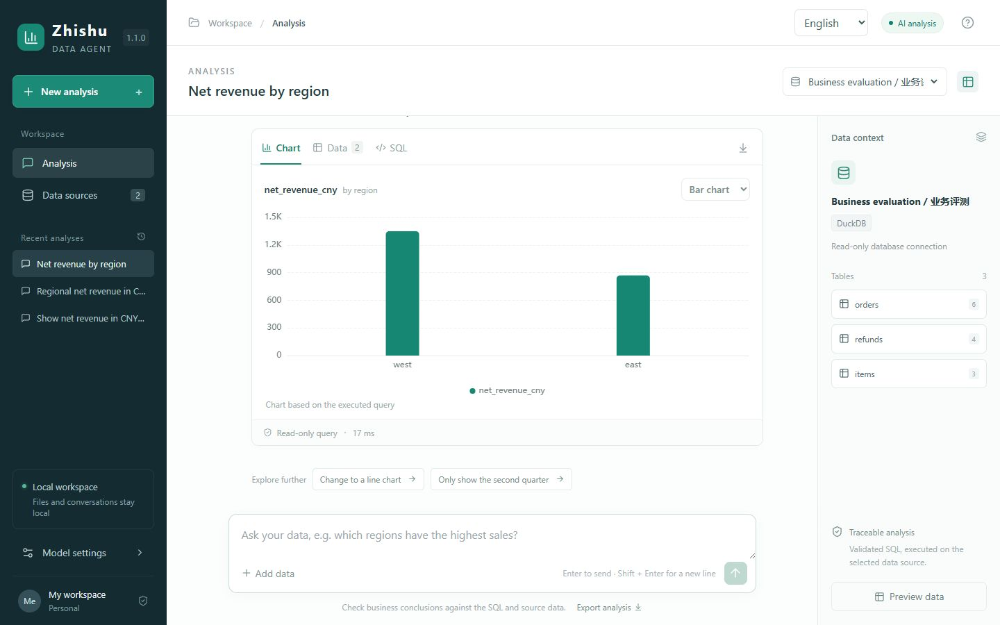

# Zhishu 知数

A bilingual, locally running data analysis assistant. Ask in natural language and get inspectable SQL, charts and findings.

[简体中文](README.md) · [Download for Windows](https://github.com/Runc3m/zhishu-data-agent/releases) · [User guide](docs/usage.en.md) · [Roadmap](docs/roadmap.en.md)



## From questions to results

- **Natural-language analysis**: inspect the schema, plan a query, execute read-only SQL and attempt bounded repairs when needed.
- **Charts beside their queries**: bar, line and pie charts, sortable result tables and the SQL that actually ran.
- **Local data workspace**: import CSV or connect to PostgreSQL / MySQL; sources and analysis history are saved automatically.
- **Chinese and English**: switch the interface, analysis messages and suggested questions without rewriting existing conversations or raw data.
- **Simple model setup**: DeepSeek requires only an API key; other Chat Completions-compatible providers and local models are supported too.
- **Business definitions**: describe columns, metrics and relationships per source; analyses retain the context version used to explain their basis.
- **Try it without a key**: demo mode executes predefined queries against synthetic records, without calling a model.
- **Export your work**: download query results as CSV and analysis records as Markdown.

For individual analysts, operators and developers exploring data, checking metrics and preparing analysis. This is a single-user local tool, without public hosting or team accounts.

## Quick start

### Windows users

1. Download the latest `Zhishu-v1.1.0-windows-x64.zip` from [Releases](https://github.com/Runc3m/zhishu-data-agent/releases).
2. Extract the entire archive, open the `Zhishu` folder and double-click `Zhishu.exe`.
3. Your browser opens the workspace. Select a suggested question to explore the sample sales data.

No Python or Node.js installation is required. Keep the launch center open or minimized while working, then select Quit Zhishu. See the [user guide](docs/usage.en.md) for installation, updates and storage locations.

### Developers

Requires Windows, Python 3.13, Node.js 22+ and pnpm 11.19.0.

```powershell
git clone https://github.com/Runc3m/zhishu-data-agent.git
cd zhishu-data-agent
.\start.ps1 -Rebuild
```

Open the local address printed by the script. See the [development guide](docs/development.en.md) for testing, architecture and packaging.

## Try an analysis

Select Sample sales data, ask “Monthly sales trend”, follow up with “Only show the second quarter”, then “What about profit?”. Change the chart type, inspect the SQL or export results.

For your own CSV, preview columns first. Open-ended questions require AI in Model settings. Follow the [model setup guide](docs/models.en.md).

Files and history are stored locally. With remote AI enabled, questions, schema, configured business context, recent conversation and up to 30 result rows are sent to the selected provider and consume its API allowance.

See [business context](docs/business-context.en.md) and the [evaluation guide](docs/evaluation.en.md) for defining metrics and checking results.

## Documentation and contributions

[User guide](docs/usage.en.md) · [Model setup](docs/models.en.md) · [Development](docs/development.en.md) · [FAQ](docs/faq.en.md) · [Contributing](CONTRIBUTING.en.md) · [Roadmap](docs/roadmap.en.md) · [Changelog](CHANGELOG.en.md)

Reproducible bug reports, suggestions and pull requests are welcome. Original code is under the [MIT license](LICENSE). See [third-party notices](THIRD_PARTY_NOTICES.md) for dependency licenses and product inspiration.
