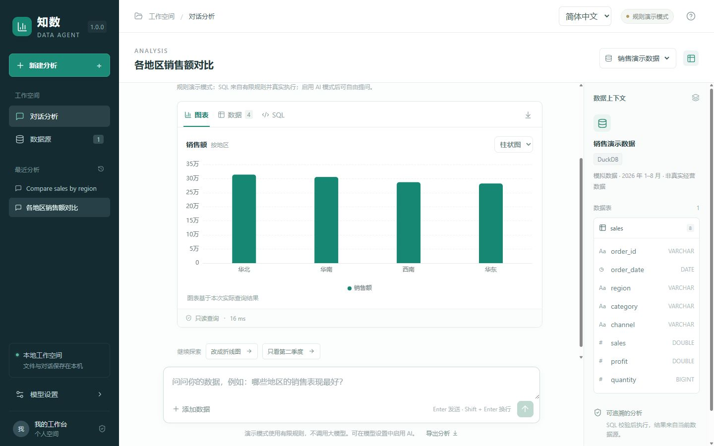

# 知数 Zhishu

一个支持中英文、在本地运行的数据分析助手。用自然语言提问，获得可检查的 SQL、图表与分析结论。

[English](README.en.md) · [下载 Windows 应用](https://github.com/Runc3m/zhishu-data-agent/releases) · [使用指南](docs/usage.zh-CN.md) · [路线图](docs/roadmap.zh-CN.md)



## 从问题到结果

- **自然语言问数**：读取数据结构、制定查询计划、执行只读 SQL，在失败时进行有限修正。
- **图表与查询放在一起**：柱状图、折线图、饼图、可排序数据表，以及实际执行的 SQL。
- **本地数据工作空间**：导入 CSV，或连接 PostgreSQL / MySQL；数据源与分析历史自动保存。
- **中英文切换**：界面、分析提示与建议问题随语言切换；已有对话和原始数据保持原样。
- **轻量模型配置**：DeepSeek 只需填写 API Key；也支持兼容 Chat Completions 的服务及本地模型。
- **无需密钥即可体验**：规则演示用预设查询分析实际执行的模拟记录，不调用模型。
- **带走结果**：导出 CSV 查询结果和 Markdown 分析记录。

适合个人分析师、运营人员与开发者探索数据、核对指标、准备分析材料。当前是单用户本地工具，不包含公网托管与团队账号。

## 快速开始

### Windows 用户

1. 从 [Releases](https://github.com/Runc3m/zhishu-data-agent/releases) 下载 `Zhishu-v1.0.0-windows-x64.zip`。
2. 完整解压，打开 `Zhishu` 文件夹，双击 `Zhishu.exe`。
3. 浏览器会打开分析工作空间。点击建议问题，即可体验内置销售数据。

不需要安装 Python 或 Node.js。使用时保留启动中心，可最小化；结束时点击“退出知数”。安装、升级与存储位置见[使用指南](docs/usage.zh-CN.md)。

### 开发者

需要 Windows、Python 3.13、Node.js 22+ 和 pnpm 11.19.0。

```powershell
git clone https://github.com/Runc3m/zhishu-data-agent.git
cd zhishu-data-agent
.\start.ps1 -Rebuild
```

打开脚本显示的本地地址。测试、架构与打包见[开发指南](docs/development.zh-CN.md)。

## 一个使用示例

选择“销售演示数据”，提问“每月销售趋势”，接着问“只看第二季度”，再试试“那利润呢”。可以切换图表类型、查看 SQL、导出结果。

分析自己的 CSV 时，先预览字段；自由提问需要在“模型设置”启用 AI。详细步骤见[模型配置](docs/models.zh-CN.md)。

文件和历史记录存储在本机。启用远程 AI 后，问题、数据结构、最近对话与最多 30 行查询结果会发送给所选模型服务，并使用该服务的 API 额度。

## 文档与参与

[使用指南](docs/usage.zh-CN.md) · [模型配置](docs/models.zh-CN.md) · [开发构建](docs/development.zh-CN.md) · [常见问题](docs/faq.zh-CN.md) · [贡献指南](CONTRIBUTING.md) · [路线图](docs/roadmap.zh-CN.md) · [更新日志](CHANGELOG.md)

欢迎提交可复现的问题、改进建议与 Pull Request。自有代码使用 [MIT 许可证](LICENSE)；依赖许可与产品思路致谢见[第三方说明](THIRD_PARTY_NOTICES.md)。
